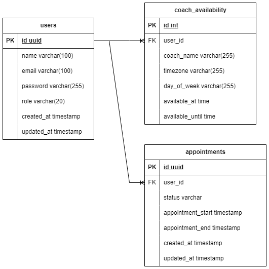

# Coach Appointment App
<div id="top"></div>
<!-- PROJECT LOGO -->
<br/>
<div align="center">

  <h3 align="center">Project "Coach Appointment App"</h3>

  <p align="center">
    Building RESTful API Using Golang
    <br />
    <br />
  </p>
</div>


<!-- ABOUT THE PROJECT -->
## 💻 &nbsp;About The Project
Fita is one of the company that moving in Health Industry. They have a great vision to bring the healthiness in Indonesia. To achieve that goals, they need to supervise users by providing consultation with coach feature.
The requirement is simple, user can make an appointment with coach if only coach didn't have another appointment and have an availability. 

### Features
- Coach
    - Login/Logout
    - Accept Appointment
    - Reject Appointment
    - Request Reschedule Appointment
- User
    - Login/Logout
    - Request Appointment
    - Reschedulling Appointment
    - Reject Reschedule Request from Coach

### &nbsp;Images
<details>
<summary>&nbsp;🖼 ERD</summary>

</details>

### 🛠 &nbsp;Built With

&nbsp;
&nbsp;
&nbsp;
&nbsp;
&nbsp;
&nbsp;

<!-- FLOW -->
## &nbsp;Flow
### &nbsp;Create Appointment
```
Payload create Appointmnet:
{
    "coach_name": "Nola Murazik V",
    "appointment_start":"2023-06-22T01:00:00+08:00",
    "appointment_end": "2023-06-22T01:30:00+08:00"
}
```
- Untuk create appointment, user perlu memasukkan beberapa payload seperti contoh di atas. Flownya, appointment_start dan appointment_end akan dikonversi ke dalam timezone coach yang diinputkan. Lalu setelah dikonversi ke timezone local coach, ke dua paramater ini akan dibandingkan dengan time availabilitynya coach. Coach availability ini disimpan dalam table "coach_availability". Flow:
    - pertama akan mengambil day of week, lalu akan dibandingkan dengan day of weeknya coach.
    - setelah itu baru membandingkan waktunya, apakah range waktu yang diinputkan user masuk ke dalam range waktu coach availability time coach.
    - setelah semua tervalidasi, kemudian melakukan insert ke db table "appointment" dengan status appointment "CREATED"

### &nbsp;Update Appointment
&nbsp;Urutan status appointment<br>
&nbsp;status yang tersedia:
- CREATED -- by user
- COACH_ACCEPTED -- by coach
- COACH_REJECTED -- by coach
- RESCHEDULE_REQUESTED -- by coach
- RESCHEDULE_REJECTED -- by user
- RESCHEDULING -- by user
- END -- cron scheduller

&nbsp;Case1:<br>
&nbsp;CREATED -> COACH_ACCEPTED -> END

&nbsp;Case2:<br>
&nbsp;CREATED -> COACH_REJECTED -> END

&nbsp;Case3:<br>
&nbsp;CREATED -> RESCHEDULE_REQUESTED -> RESCHEDULE_REJECTED -> END

&nbsp;Case4:<br>
&nbsp;CREATED -> RESCHEDULE_REQUESTED -> RESCHEDULING -> COACH_ACCEPTED -> END

&nbsp;Case5:<br>
&nbsp;CREATED -> RESCHEDULE_REQUESTED -> RESCHEDULING -> COACH_REJECTED -> END

1. &nbsp;Accept Appointment
```
{
    "id":"863adb67-c9f5-4339-af00-e21f45c528bb",
    "new_status": "coach_accepted"
}   
```
- Accept appointment ini dilakukan oleh coach. Yang mana caranya hanya mengupdate status pada table appointment dari status CREATED atau RESCHEDULING ke status COACH_ACCEPTED

2. &nbsp;Reject Appointment
```
{
    "id":"863adb67-c9f5-4339-af00-e21f45c528bb",
    "new_status": "coach_rejected"
}   
```
- Reject appointment ini dilakukan oleh coach. Yang mana caranya hanya mengupdate status pada table appointment dari status CREATED atau RESCHEDULING ke status COACH_REJECTED

3. &nbsp;Request Reschedule Appointment
```
{
    "id":"863adb67-c9f5-4339-af00-e21f45c528bb",
    "new_status": "reschedule_requested"
}   
```
- Request reschedule appointment ini dilakukan oleh coach. Yang mana caranya hanya mengupdate status pada table appointment dari status CREATED ke status RESCHEDULE_REQUESTED

4. &nbsp;Reject Reschedule Request
```
{
    "id":"863adb67-c9f5-4339-af00-e21f45c528bb",
    "new_status": "reschedule_rejected"
}   
```
- Reject Reschedule Request ini dilakukan oleh user. Yang mana caranya hanya mengupdate status pada table appointment dari status RESCHEDULE_REQUESTED ke status RESCHEDULE_REJECTED

5. &nbsp;Accept Reschedule Request
```
{
    "id":"863adb67-c9f5-4339-af00-e21f45c528bb",
    "appointment_start": "2023-06-21T03:00:00+08:00",
    "appointment_end": "2023-06-21T03:30:00+08:00"
}   
```
- Accept Reschedule Request ini dilakukan oleh user. Yang mana caranya cukup berbeda dari flow yang sudah dijelaskan di atas. Pada operasi ini user perlu memasukkan range waktu appointment yang baru untuk diupdate ke table appointment. Statusnya juga akan berubah dari status RESCHEDULE_REQUESTED ke status RESCHEDULING

6. &nbsp;Accept or Reject Reschedule from User

- Operasi ini dilakukan oleh coach untuk menerima atau menolak jadwal baru yang diajukan oleh user. Operasinya sama seperti operasi di nomor 1 dan 2.

<!-- HOW TO USE -->
## &nbsp;How to Use
### * Running on Local Server
- Install Golang, Postman, PostgreSQL Management System (ex. pgAdmin 4)
- Clone repository:
```
git clone https://github.com/RyanAdiW/group4-capstone-project.git
```
* Run `main.go` on local terminal
```
$ go run app/main.go
```
* Run the endpoint

<!-- CONTACT -->
## 📮 &nbsp;Contact

[](https://github.com/ryanadiw)

<p align="center">:copyright: 2023</p>
</h3>